<div align="center">

<!-- Static name — Bricolage Grotesque, theme-aware -->
<picture>
  <source media="(prefers-color-scheme: dark)" srcset="https://readme-typing-svg.demolab.com?font=Bricolage+Grotesque&weight=800&size=52&duration=1&pause=99999&color=FFFFFF&center=true&vCenter=true&repeat=false&width=700&height=80&lines=Hey+there%2C+I%27m+Abhishek+%F0%9F%91%8B" />
  
</picture>

<!-- Animated cycling roles -->
[](https://git.io/typing-svg)

<p>
  <a href="https://linkedin.com/in/abhishek-singh-fm" target="_blank">
    
  </a>
  <a href="https://x.com/abhidottsx" target="_blank">
    
  </a>
  <a href="mailto:abhisheksingh.fm@gmail.com">
    
  </a>
  <a href="https://github.com/Abhishekfm" target="_blank">
    
  </a>
</p>


</div>

---

## 🧠 About Me

```ts
const abhishek = {
  title:        "Senior Full Stack Engineer · Frontend Architect",
  location:     "India 🇮🇳",
  experience:   "4+ years",
  focus:        ["Scalable UIs", "Data Visualization", "Design Systems", "Open Source"],
  stack:        ["React", "Next.js", "TypeScript", "Node.js", "D3.js", "Python"],
  ask_me_about: ["System Design", "DSA", "Web Performance", "AI"],
};
```

Full Stack Engineer with **4+ years** building production-grade web products across civic tech, industrial SaaS, and social commerce. Reduced frontend latency by **40%** and boosted load speed by **50%** through React/Redux/RTK optimization. Delivered **100% SEO optimization** on a social-commerce platform. Passionate about data visualization, open-source, and writing code that's as clean as it is fast.

- ⚡ Fun fact: I treat every pixel like it matters — because it does.

---

## 🛠️ Tech Stack & Tools

### 🎨 Frontend


### 🗺️ Maps & Visualization


### ⚙️ Backend


### 🗄️ Databases & Cloud


### 🧰 Dev Tools & Workflow


---

## 📊 GitHub Stats

<table width="100%" cellspacing="0" cellpadding="4" border="0" style="border:none;border-collapse:collapse;">
  <tr>
    <td width="33%" align="center" style="border:none;">
      
    </td>
    <td width="33%" align="center" style="border:none;">
      
    </td>
    <td width="33%" align="center" style="border:none;">
      
    </td>
  </tr>
</table>

---

## 🏆 GitHub Trophies

<div align="center">

[](https://github.com/ryo-ma/github-profile-trophy)

</div>

---

## 📈 Contribution Graph

<div align="center">

[](https://github.com/ashutosh00710/github-readme-activity-graph)

</div>

---

## 💡 What I Bring to the Table

```
✦  4+ years shipping production-grade web products across civic tech, SaaS & social commerce
✦  Built a Grafana-like dashboard solo — REST APIs in FastAPI + interactive UI in React/D3.js
✦  40% latency reduction & 50% load speed boost through React/Redux/RTK optimization
✦  Backend chops: Node.js, Express, FastAPI, MongoDB — APIs, pipelines & Docker deployments
✦  100% SEO optimization & 40% faster load times on a social-commerce platform
✦  Large-scale data viz with D3.js & DevExtreme — pan/zoom across massive datasets
✦  Open source contributor: UI component libraries & AI auditing frameworks
```

## 🏅 Achievements

| | |
|---|---|
| 🎓 **GATE 2022** | Qualified in Computer Science — among ~2 Lakh engineers, one of India's toughest exams |
| 🌍 **IndiaAI Summit** | Exhibited ParakhAI — participatory AI auditing framework at India's national AI summit |

---

<div align="center">

*"First, solve the problem. Then, write the code — beautifully."*


</div>
